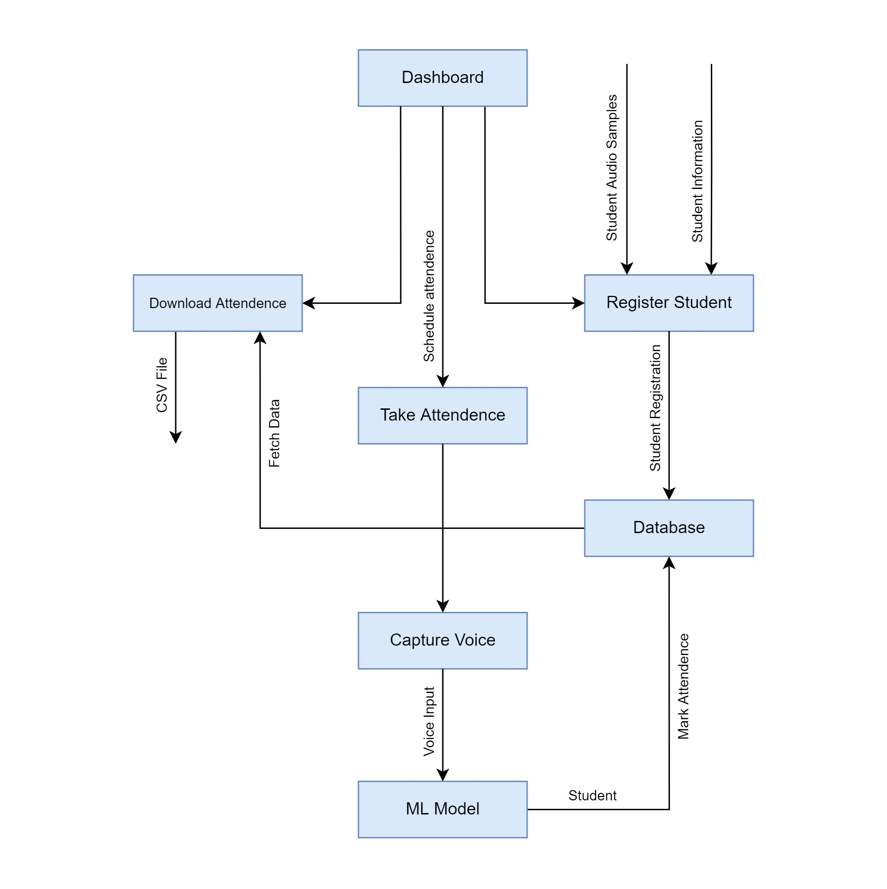

# Language-Independent-Speaker-Identification-System

**NOTE**: You might get `No Backend Error` for some audio files when predicting results, to avoid that you need `ffmpeg` which u can install without hassle using ["imagemagic"](https://imagemagick.org/script/index.php). Just go to the link and install imagemagic and that's it.

## Goal
The application aims to minimize time taken in the manual attendance system and also remove the problem of fake attendance in many areas of work and study. The application helps the teacher schedule attendance on a daily basis just by using the voice of the students. He/She can download the attendance and even add new students to the database and their respective voices.

## Technologies Used
- Django
- SQLite
- Keras
- Librosa
- Numpy
- Pandas
- Speech Recognition
- Scikit-learn

## Flowchart

The above diagram shows the brief working of our website, this includes Frontend, Backend, 
database, API, and machine learning models

 

 

### ML Model

 
The ML Model takes the Student’s Audio as Input and Predict the student and mark attendance of that student.

The Process for predicting the student based on Audio:
- The Audio is Recorded in Front-end as audio blob and converted the into base64 string 
then the base64 string send to server using as AJAX request.
- The base64 string is received at back-end and it is converted into Audio File.
- Then the Audio file is given to the ML Model as Input to predict student.
- Then the Audio file is load using Librosa library and audio vector and its sample rate is extracted from the audio file.
- Using the Audio Vector features like mfcc, chroma_stft, rmse, spec_cent, spec_bw, 
rolloff, zcr are extracted and put into a python list.
- The python list is then converted into a numpy array and reshape to shape like (1, features.shape[0])
- Then the array is scaled using the standard scaler.
- And scaled features is used to predict the student roll number using which we can extract the details of the student from database.
- Once the student’s detail is found using roll number then his/her attendance is marked

 

## Interface Design

### Login Page

 

### Dashboard

 

#### Attendance Page

## Future Work

Some of the possible improvements which can be done in this project are : -
### Improving ML Model
Currently the model is under trained due to less Audio samples used, in future concept called “Data Augmentation” can be introduced which will help eliminate the problem of model being under trained.

### Noise Reduction
Another reason for Low Accuracy of ML Model is Noise in Audio Files. To Significantly improve the Accuracy of ML Model, Noise Reduction can also be implement which will eliminate the excess noise from background

## Summary

The purpose of reducing the errors that occur in the traditional attendance taking system has been achieved by implementing this automated attendance system. By using this technology we can overcome the problems of fake attendance and also save time and increase efficiency. Other than  attendance, speaker identification using voice has many other applications like smart homes, digital assistants, etc

